# Installing openstack and contrail in VMM
release 0.2
This document provides information on how to install Openstack and Contrail in the VMM environment.

This document is tested with Openstack Queen, Contrail Networking 1912.32 and Appformix 3.1.12

## Topology
The logical topology of the testbed is as follows :


The devices/nodes in the topology are :

1. GW
    - gateway between juniper's intranet and testbed network
2. Contrail nodes 
    - node0 : Openstack/Contrail contoller
    - node1 : compute
    - node2 : compute
    - node3 : CSN (contrail service node)
    - node4 : Appformix
    - node5 : contrail command
    - node6 : deployer
3. DC Fabric
    - VMX : DCGW
    - spine1, spine2, leaf1, leaf2 : DC Fabric
4. Servers
    - svr1, svr2, svr3 : BMS in the DC Fabric
    - ext1l3 : External node connected through L3
    - ext2l2 : external node connected through L2

subnets in the testbed
- lan1 : 172.16.11.0/24
- vmxg0 (link between GW and VMX ) : 172.16.12.12/31
- vmxg1 (link between GW and VMX ) : 172.16.12.14/31
- management: 172.16.13.0/24
- loopback for vMX and vQFX : 172.16.255.0/24

## Setup the testbed
1. Create yaml file for the lab topology, or you can use the following [lab.yaml](lab.yaml)
2. Create the topology using this [script](https://github.com/m1r24n/running_on_vmm) to create the configuration files and upload them into the VMM pod

3. Start the topology using the same script

4. Record the IP address of GW assigned by VMM

5. Wait for few minutes to allow the VMs to be up and running
6. SSH into GW and verify that all nodes are up and running
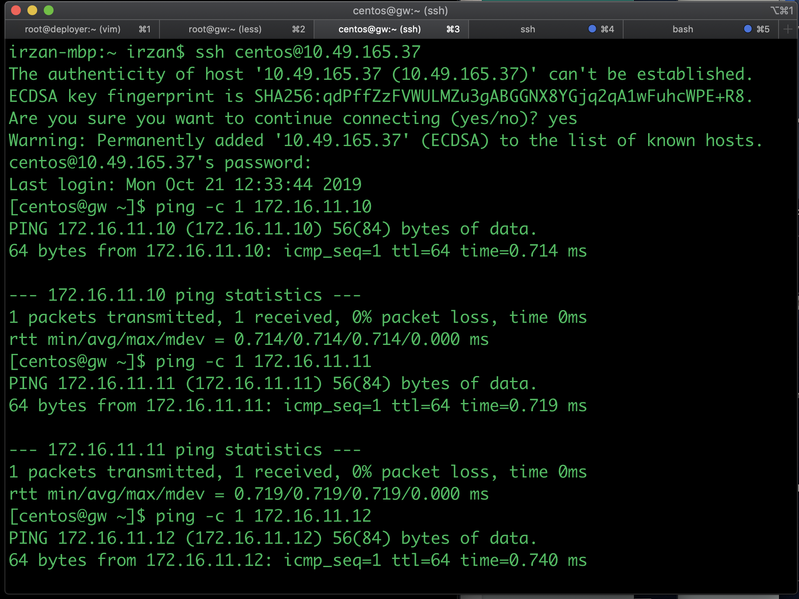
7. (optionally) install wireguard to have direct access to node from your workstation. Follow this [instruction](https://github.com/m1r24n/running_on_vmm/tree/master/install_wg_on_vmm) on how to install wireguard on VM inside the VMM.
8. Establish VPN connection from your workstation to GW
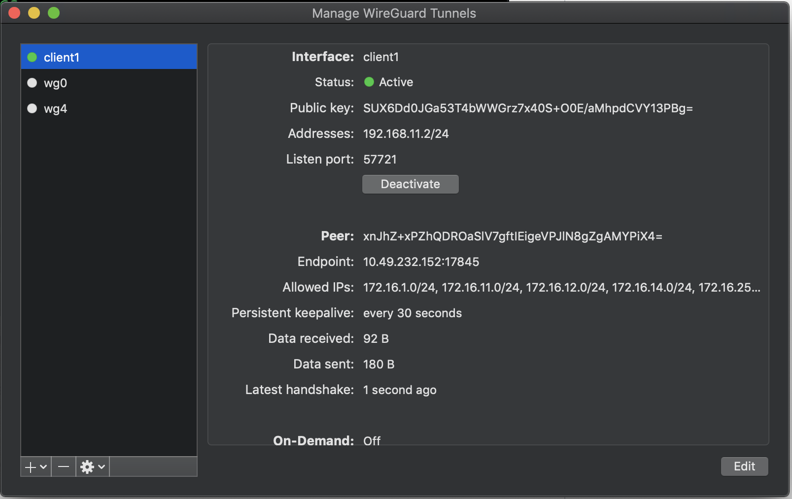
9. Test direct access into the nodes from your workstation


## IP Fabric configuration
the DC fabric consist of vQFX (spine1, spine2, leaf1 and leaf2) and vMX.

You can create your own configuration for the junos devices, or use the following example of [junos_config](junos_config/conf).

The IP fabric configuration is eBGP routing protocol and static for underlay.
1. To access the devices directly from your workstation, you can copy the file [ssh_config](ssh_config) into your ~/.ssh/config. Don't forget to set the ip address of vmmgw to the ip address of the jump host
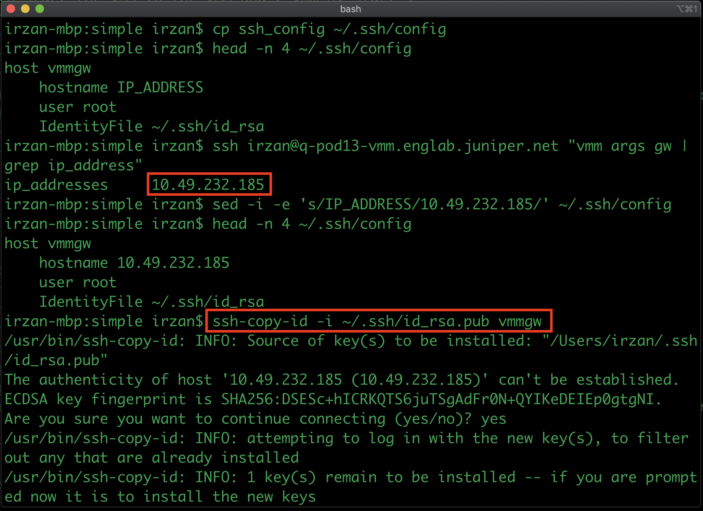
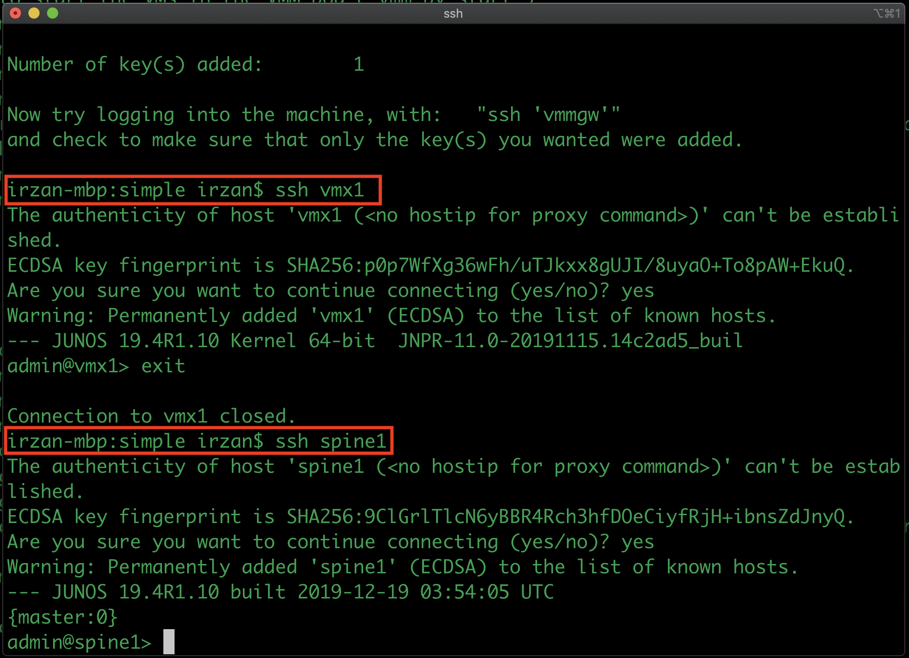

2. open ssh gw into GW, and create static route to 172.16.255.0/24 (to provide connectivity to the loopback of the junos device in the ip fabric
```
   ip route add 172.16.255.0/24 via 172.16.12.13
```


3. To make static route permanent, add it into /etc/rc.local
```
   echo "ip route add 172.16.255.0/24 via 172.16.12.13" >> /etc/rc.local
```


4. The following [junos configuration](junos_config/conf/) can be used, which will establish IP Fabric using eBGP. Ansible playbook [config2.8.yaml](junos_config/config2.8.yaml) can be used to upload the configuration into VMX and VQFX
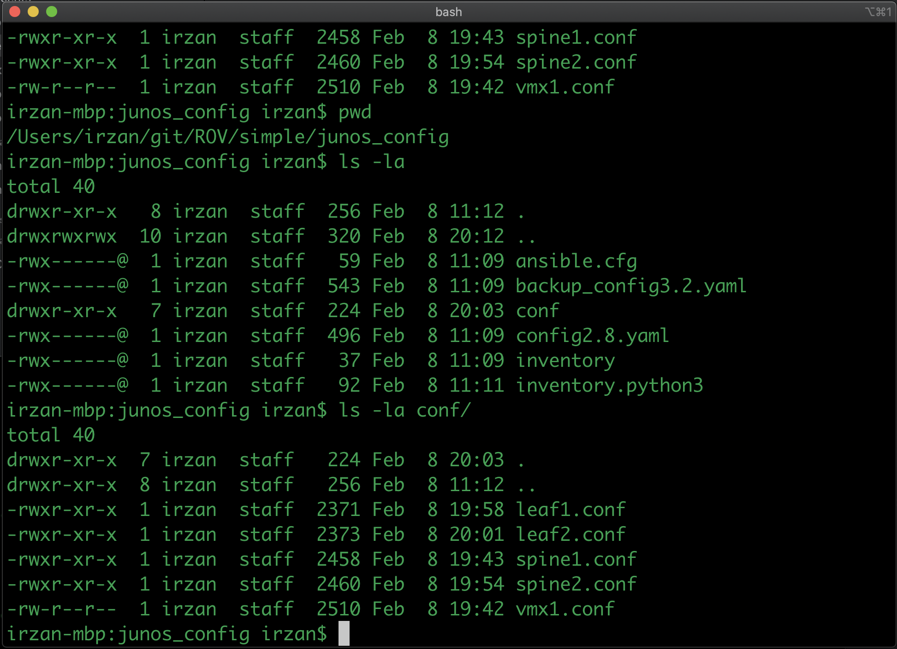
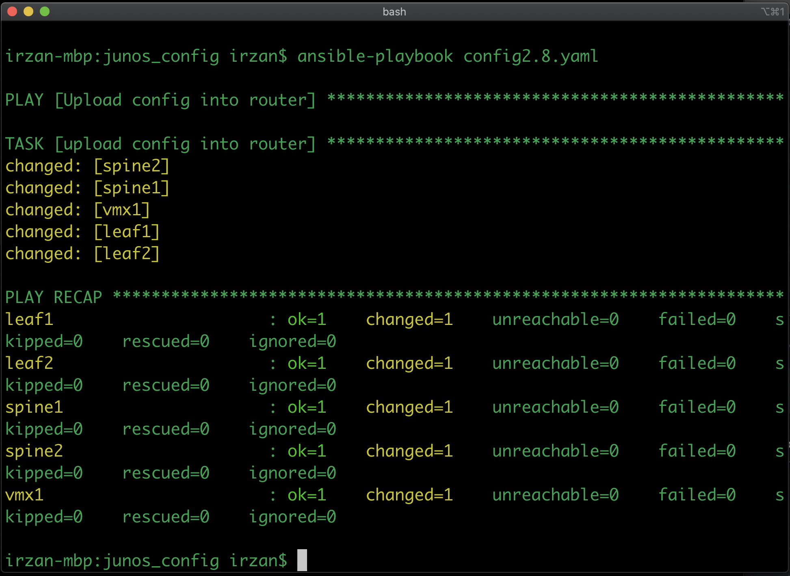

5. Another Ansible playbook [backup_config3.2.yaml](junos_config/backup_config3.2.yaml) can be used to backup the configuration from VMX and VQFX

6. Access node0, and test connectivity to vmx1, spine1, spine2, leaf1, and leaf2


## Initial nodes configuration 
1. Access node6 (deployer node), and verify the following on node6
    - from node6, all the other node (node0 to node5) are accessible
    - file /etc/hosts has entries for all nodes and devices in the testbed, especially contrail nodes. If node6 doesn't have it, then copy the following into /etc/hosts
    ```
    127.0.0.1       localhost.localdomain localhost
	::1             localhost6.localdomain6 localhost6
	172.16.11.1     gw
	172.16.11.10    node0
	172.16.11.11    node1
	172.16.11.12    node2
	172.16.11.13    node3
	172.16.11.14    node4
	172.16.11.15    node5
	172.16.11.16    node6
	172.16.255.20    vmx1 
	172.16.255.21    spine1
	172.16.255.22    spine2
	172.16.255.23    leaf1
	172.16.255.24    leaf2
    ```
2. create ssh-key on node6

3. copy the ssh-key to node0 .. node5 to allow passwordless ssh access from node6 

	command to copy ssh-key

```
	for i in {0..5}
	do
		ssh-copy-id -i ~/.ssh/id_rsa.pub root@node${i}
	done
```

4. Copy file /etc/hosts to node0 .. node5

command to copy /etc/hosts

```
	for i in {0..5}
	do
		scp /etc/hosts root@node${i}:/etc/hosts
	done 
```
## Openstack and Contrail installation using ansible deployer
1. For the latest contrail networking, please follow the [manual](https://www.juniper.net/documentation/en_US/contrail19/topics/concept/install-contrail-ocata-kolla-50.html)

	The documentation mention that the ansible version required is 2.7.10, 
	but this version may not be available anymore from EPEL repository.

	To install ansible version 2.7.10, please use python pip, do not use yum.

```
		yum -y install epel-release
		yum -y update
		yum -y install git python-pip
		pip install ansible==2.7.10
		yum -y remove PyYAML python-requests
		pip install PyYAML requests
		yum -y install sshpass
```

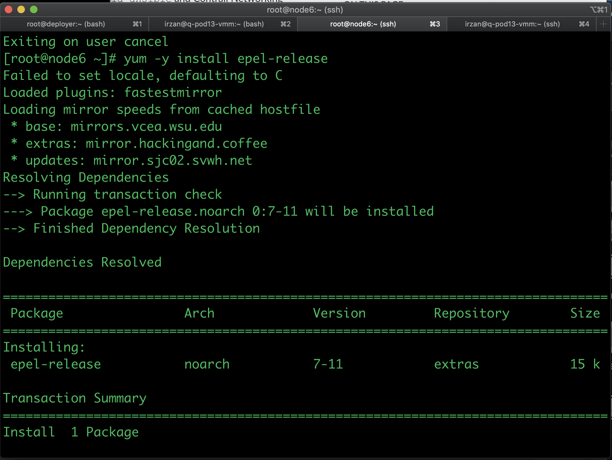


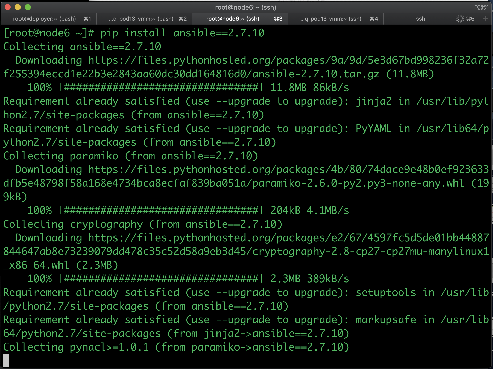
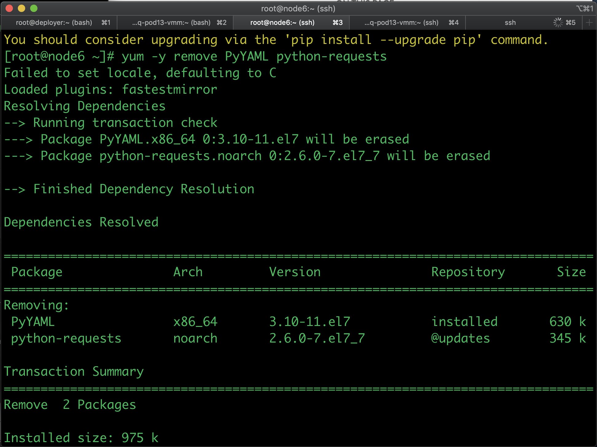
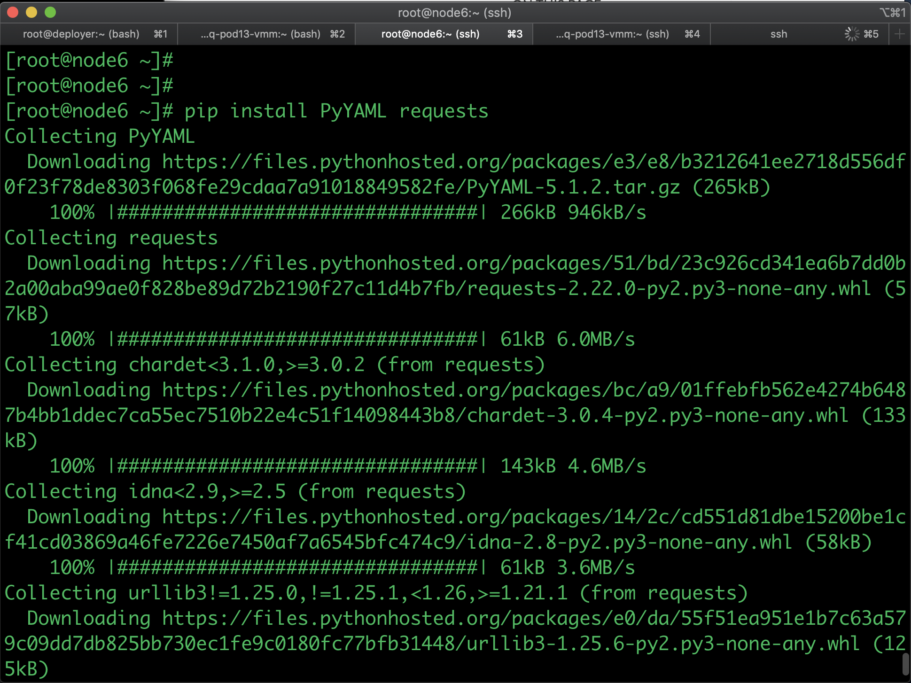

2. Upload the ansible deployer file into node6 and unzip the file
3. Upload this file [instances.yaml](contrail_config/instances.yaml) to node6, and put it inside directory `contrail-ansible-deployer/config


4. Get the vga_port of VM node6, and use this information (host and port number) to open VNC session to the console of node6 (using this method to run the playbooks, allow you to disconnect remote access session, and leave the playbook run until it finish). It may take 30 to 60 minutes to install.


5. Enter contrail-ansible-deployer directory, and start the following command :
    - ansible-playbook -e orchestrator=openstack -i inventory/ playbooks/configure_instances.yml

6. Run the following command :
    - ansible-playbook -i inventory/ playbooks/install_openstack.yml

7. Run the following command :
    - ansible-playbook -e orchestrator=openstack -i inventory/ playbooks/install_contrail.yml

8. Contrail installation is done. It can be verified by accessing the openstack dashboard (http://172.16.11.10) or contrail dashboard (old UI, http://172.16.11.10:8180) or run the command `contrail-status` on any of the contrail-nodes (controller, compute, or CSN)

## Appformix Installation
1. ssh into the compute nodes, and install libvirt-client

2. On deployer node, create directory ~/appformix, and upload the appformix installation files and license into this directory.


3. The yaml file for appformix installation is part of the [instances.yaml](contrail_config/instances.yaml)

4. Extract appformix installation file, and enter the directory where the extracted file is located.

5. Run the playbook to install appformix

6. Appformix installation is done. It can be verified by accessing the appformix dashboard, http://172.16.11.14:9000)

## Contrail Command installation and importing the existing cluster into the contrail command

The documentation is available [here](https://www.juniper.net/documentation/en_US/contrail19/topics/task/configuration/import-cluster-data-contrail-command.html)

1. Upload the [command_servers.yml](contrail_config/command_servers.yml) to node6
2. Install docker into node6

2. Login into hub.juniper.net
3. Pull contrail command deployer container

4. Install contrail command and import the existing cluster with the following command:
    ```
    docker run -t --net host -e orchestrator=openstack -e action=import_cluster -v $PWD/command_servers.yml:/command_servers.yml -v $PWD/instances.yaml:/instances.yml -d --privileged --name contrail_command_deployer hub.juniper.net/contrail/contrail-command-deployer:1910.23
    ```
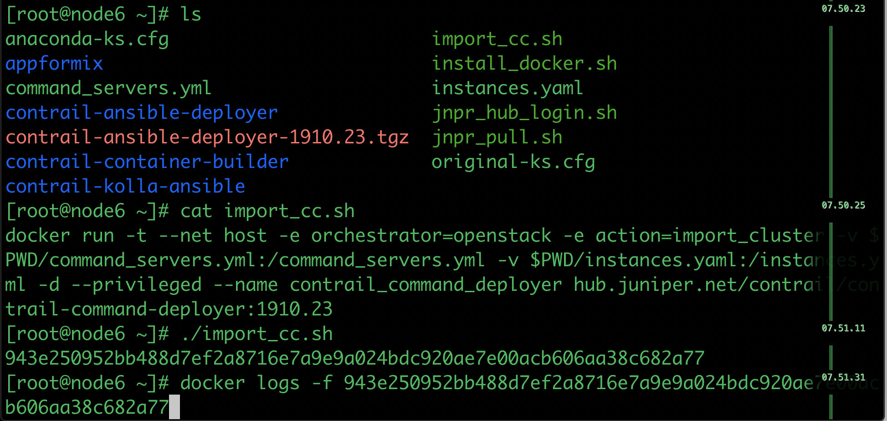
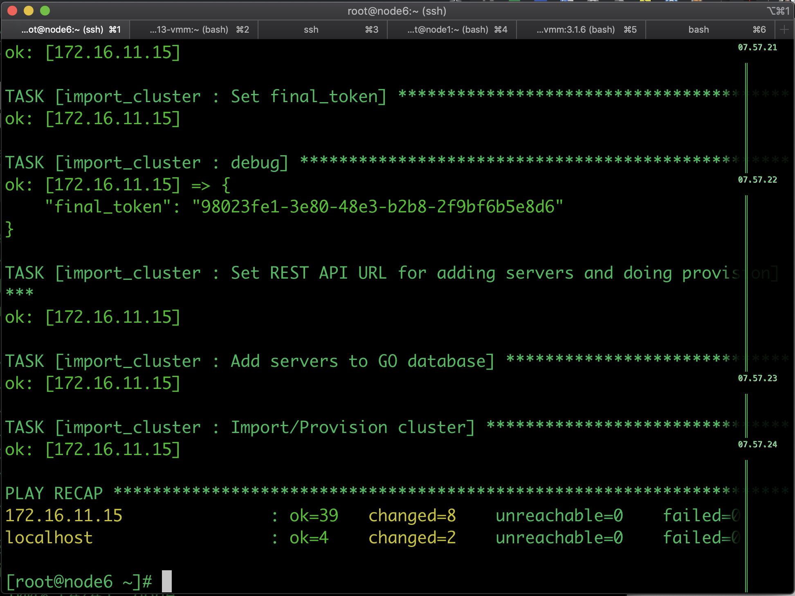

5. When the installation is finish, contrail command can be accessed at https://172.16.11.15:9091.

6. Now the installation of openstack, contrail networking, appformix and contrail command is done. You can start playing around with it or you can use the following [lab exercise](https://github.com/m1r24n/running_on_vmm/tree/master/contrail/contrail_lab_exercise)
